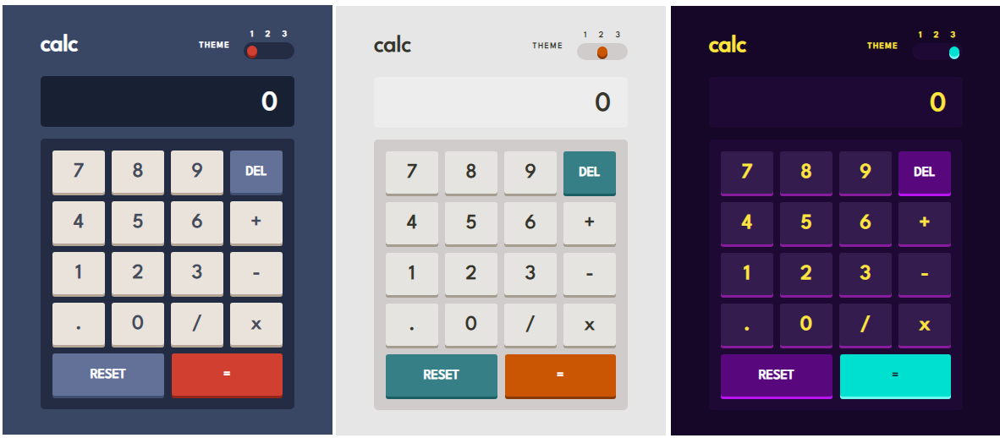

# Frontend Mentor - Calculator app solution

This is a solution to the [Calculator app challenge on Frontend Mentor](https://www.frontendmentor.io/challenges/calculator-app-9lteq5N29).

## Table of contents

- [Overview](#overview)
  - [The challenge](#the-challenge)
  - [Screenshot](#screenshot)
  - [Links](#links)
- [My process](#my-process)
  - [Built with](#built-with)
  - [What I learned](#what-i-learned)
- [Author](#author)

## Overview

### The challenge

Users should be able to:

<!-- - See the size of the elements adjust based on their device's screen size -->
- Perform mathmatical operations like addition, subtraction, multiplication, and division
- Adjust the color theme based on their preference
<!-- - **Bonus**: Have their initial theme preference checked using `prefers-color-scheme` and have any additional changes saved in the browser -->

### Screenshot



### Links

- Solution URL: [solution URL](https://github.com/zemira-k/calculator-app-main.git)
- Live Site URL: [live site URL](https://zemira-k.github.io/calculator-app-main/)

## My process

### Built with

- Semantic HTML5 markup
- CSS custom properties
- Flexbox
- CSS Grid
- Mobile-first workflow
- [React](https://reactjs.org/) - JS library

### What I learned

Context API
grid

```css
.small-buttons-container {
  display: grid;
  grid: 1fr 1fr 1fr 1fr / 1fr 1fr 1fr 1fr;
  gap: 8px;
  padding: 14px 14px 8px;
  border-radius: 5px;
}
```
```js
import { createContext, useState } from "react";

export const ThemeContext = createContext(null);

export const ThemeContextProvider = ({children}) => {
return(
    <ThemeContext.Provider value={useState("Theme-1")}>
        {children}
    </ThemeContext.Provider>
    )
}
```

## Author

- Website - (https://github.com/zemira-k)
- Frontend Mentor - (https://www.frontendmentor.io/profile/zemira-k)
